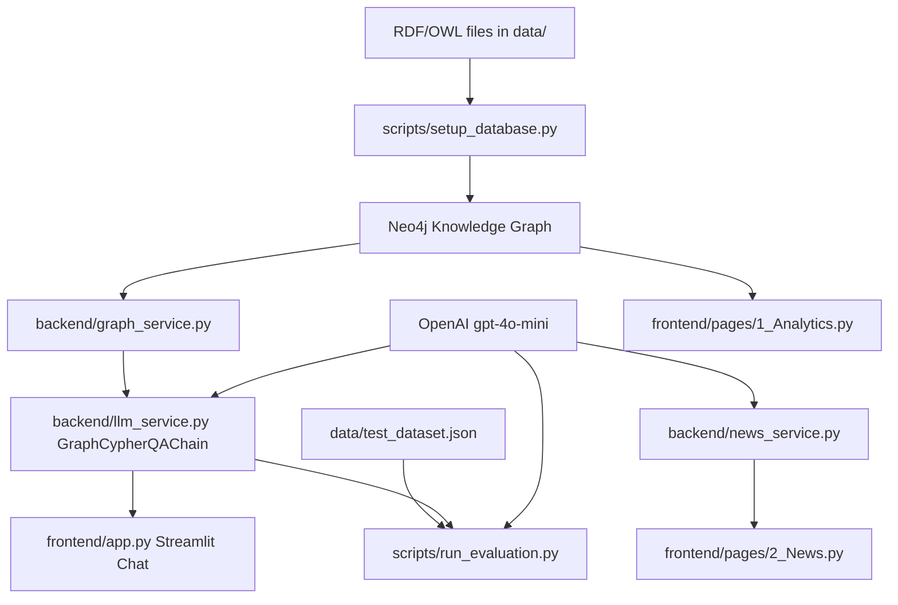

# Knowledge-Based RAG Project Report

## 1. Project Overview

This repository implements **SportLLM**, a Knowledge-Based RAG / Graph RAG application for equestrian sports. The main goal is to let a user ask natural-language questions, mostly in French, about an equestrian knowledge graph and receive grounded answers generated from graph data.

The core system uses RDF/OWL data as the source knowledge representation, loads that data into Neo4j, and uses LangChain's `GraphCypherQAChain` with OpenAI `gpt-4o-mini` to translate user questions into Cypher queries. Query results are then passed back to the LLM to produce a natural-language answer. The user-facing interface is a Streamlit application with a chat page, analytics page, and news page.

The project also includes an evaluation script that runs test questions through the Graph RAG pipeline and scores answers using semantic similarity and an LLM judge.

## 2. Domain Context

The project models an equestrian sports domain with horses, riders, competitions, training phases, sensor instrumentation, seasons, and competition results.

- **Horses** are represented as `Horse` entities with properties such as `hasName` and `hasRace`. The active V8 ontology includes many horses, including Dakota, Naya, Orion, Luna, Thunder, Bella, and others.
- **Riders** are represented as `Rider` entities. Riders can be associated with horses through `AssociatedWith` in RDF, which becomes `ASSOCIATEDWITH` in Neo4j based on the current loader.
- **Events** are represented by discipline-specific classes, not by a generic `Event` label. The implemented event labels are `ShowJumping`, `Dressage`, and `Cross`.
- **Training stages** include `PreparationStage`, `PreCompetitionStage`, `CompetitionStage`, and `TransitionStage`. They store properties such as `Volume`, `Intensity`, and `Frequency`.
- **Sensors** are represented as `InertialSensors`, with anatomical subclasses/labels including `Withers`, `Sternum`, `CanonOfForelimb`, and `CanonOfHindlimb`. Sensor properties include `hasSensorID`, `hasFormat`, `hasSensorOffset`, `hasFileSize`, and `hasSensorTime`.
- **Participation** is represented through `EventParticipation` nodes connected from events and linked to horses and riders. These nodes include `rank`, which models performance/result placement.
- **Seasons** are represented as `CompetitiveSeason` entities with `seasonName`, `seasonStart`, and `seasonEnd`.
- **Experimental objectives** include `GaitClassif_01` and `FatigueDetection`, describing sensor-use goals such as gait classification and fatigue detection.

## 3. Repository Structure

| Path | Role |
| ---- | ---- |
| `README.md` | Main project documentation and quick start. Some details are outdated relative to the active V8 data and scripts. |
| `docs/IMPLEMENTATION.md` | Existing implementation notes. Useful, but still references older `Horse_generatedDataV2.rdf` and 40-question evaluation data. |
| `docs/project_report.md` | This generated project report. |
| `requirements.txt` | Python dependencies for Streamlit, LangChain, OpenAI, Neo4j, RDF parsing, plotting, scraping, and data utilities. |
| `.env.example` | Environment template. It uses `NEO4J_USERNAME`, while the code expects `NEO4J_USER`. |
| `backend/config.py` | Loads environment variables and defines OpenAI/Neo4j settings and evaluation cost constants. |
| `backend/graph_service.py` | Initializes LangChain's `Neo4jGraph`, refreshes schema, and executes Cypher queries. |
| `backend/llm_service.py` | Core Graph RAG pipeline: Cypher-generation prompt, answer prompt, OpenAI model setup, and `GraphCypherQAChain` construction. |
| `backend/evaluation_service.py` | Semantic similarity and LLM-as-judge scoring logic. |
| `backend/news_service.py` | Equestrian RSS/web news scraping and LLM-based summaries/event extraction. |
| `backend/timing_callback.py` | LangChain callback used by evaluation to measure Cypher-generation and answer-generation LLM call times. |
| `frontend/app.py` | Main Streamlit chat interface, conversation persistence, trending news cards, and Graph RAG invocation. |
| `frontend/pages/1_Analytics.py` | Streamlit analytics dashboard using direct Cypher queries against Neo4j. |
| `frontend/pages/2_News.py` | Streamlit news page using `EquestrianNewsScraper`. |
| `frontend/utils/ui_helpers.py` | Small reusable Streamlit UI helpers. |
| `frontend/style.css` | Shared CSS for the news page and general Streamlit styling. |
| `scripts/setup_database.py` | Loads active RDF file `data/Horse_V8_Clean.rdf` into Neo4j. Deletes existing graph before loading. |
| `scripts/run_evaluation.py` | Runs Graph RAG evaluation over `data/test_dataset.json` and writes JSON reports to `evaluation_results/`. |
| `data/Horse_V8_Clean.rdf` | Active RDF/OWL source used by `scripts/setup_database.py`. Header says it was generated from a verified Neo4j export with 429 nodes and 1194 relations after cleanup. |
| `data/Horse_generatedDataV2.rdf` | Older RDF data file referenced by docs, but not used by the current setup script. |
| `data/Horse_v3_augmented.rdf` to `data/Horse_v8_augmented.rdf` | Historical/augmented RDF versions. Not clearly used by runtime code. |
| `data/test_dataset.json` | Active evaluation dataset used by `scripts/run_evaluation.py`; currently contains 100 questions. |
| `data/V1_100_Questions_test_dataset.json`, `data/V2_100_Questions_test_dataset.json`, `data/V2_test_dataset.json` to `data/V8_test_dataset.json` | Versioned test datasets. Not directly used by runtime code unless manually selected. |

## 4. System Architecture

The system is a graph-first RAG application. RDF/OWL data is the source representation. A setup script parses RDF triples and creates Neo4j nodes and relationships. The backend connects to Neo4j through LangChain, gives the graph schema to an LLM prompt, generates Cypher for a user question, executes the query, and asks the LLM to produce a final French answer using only retrieved graph context.



Global layers:

- **Data source layer:** RDF/XML files and JSON evaluation datasets in `data/`.
- **RDF / ontology layer:** OWL classes, object properties, datatype properties, and named individuals in `data/Horse_V8_Clean.rdf`.
- **Knowledge graph layer:** Neo4j database populated by `scripts/setup_database.py`.
- **Backend layer:** Python modules under `backend/`.
- **Frontend layer:** Streamlit app under `frontend/`.
- **LLM / RAG layer:** LangChain `GraphCypherQAChain` using OpenAI `gpt-4o-mini`.
- **Evaluation layer:** `scripts/run_evaluation.py` and `backend/evaluation_service.py`.

## 5. Data and Ontology

The active ontology file is `data/Horse_V8_Clean.rdf`. The setup script explicitly parses:

```python
rdf_graph.parse("data/Horse_V8_Clean.rdf", format="xml")
```

The active V8 clean file is the largest and most current RDF file in the repository. Its header says it was generated from a verified Neo4j export with **429 nodes** and **1194 relations** after removing a redundant `HASPARTICIPATEDTO` relationship. Static inspection found 22 schema classes, 11 object properties, 18 datatype properties, and 429 named individuals.

Other RDF files exist, but are not used by the current loader:

- `data/Horse_generatedDataV2.rdf`
- `data/Horse_v3_augmented.rdf`
- `data/Horse_v4_augmented.rdf`
- `data/Horse_v5_augmented.rdf`
- `data/Horse_v6_augmented.rdf`
- `data/Horse_v7_augmented.rdf`
- `data/Horse_v8_augmented.rdf`

Important ontology classes in `data/Horse_V8_Clean.rdf` include:

- `CompetitiveSeason`
- `EventParticipation`
- `SportingEvent`
- `TrainingStage`
- `Human`
- `ShowJumping`
- `Dressage`
- `Cross`
- `PreparationStage`
- `PreCompetitionStage`
- `CompetitionStage`
- `TransitionStage`
- `Rider`
- `Caretaker`
- `Veterinarian`
- `Horse`
- `ExperimentalObjective`
- `InertialSensors`
- `Withers`
- `Sternum`
- `CanonOfForelimb`
- `CanonOfHindlimb`

Approximate active V8 entity counts:

| Entity/Class | Count |
| ---- | ----: |
| `Horse` | 50 |
| `Rider` | 25 |
| `InertialSensors` | 108 |
| `Withers` | 50 |
| `Sternum` | 26 |
| `CanonOfForelimb` | 20 |
| `CanonOfHindlimb` | 12 |
| `PreparationStage` | 51 |
| `PreCompetitionStage` | 51 |
| `CompetitionStage` | 50 |
| `TransitionStage` | 19 |
| `EventParticipation` | 50 |
| `ShowJumping` | 7 |
| `Dressage` | 6 |
| `Cross` | 7 |
| `ExperimentalObjective` | 2 |
| `CompetitiveSeason` | 1 |
| `Veterinarian` | 1 |
| `Caretaker` | 1 |

Important object properties include:

- `inSeason`: event to competitive season
- `hasParticipation`: event to event participation
- `hasHorse`: participation to horse
- `hasRider`: participation to rider
- `involvesActor`: training stage to human actor
- `dependsOn`: training stage to sporting event
- `CompetesIn`: horse to sporting event
- `TrainsIn`: horse to training stage
- `isAttachedTo`: sensor to horse
- `isUsedFor`: sensor to experimental objective
- `AssociatedWith`: rider to horse

Approximate active V8 relationship counts in the RDF instance data:

| RDF Predicate | Count |
| ---- | ----: |
| `involvesActor` | 314 |
| `dependsOn` | 171 |
| `TrainsIn` | 171 |
| `isAttachedTo` | 108 |
| `isUsedFor` | 108 |
| `CompetesIn` | 101 |
| `AssociatedWith` | 51 |
| `hasParticipation` | 50 |
| `hasRider` | 50 |
| `hasHorse` | 50 |
| `inSeason` | 20 |

Important datatype properties include:

- Event properties: `eventDate`, `eventLocation`, `category`
- Season properties: `seasonName`, `seasonStart`, `seasonEnd`
- Participation property: `rank`
- Training properties: `Volume`, `Intensity`, `Frequency`
- Horse properties: `hasName`, `hasRace`
- Sensor properties: `hasSensorID`, `hasFormat`, `hasSensorOffset`, `hasFileSize`, `hasSensorTime`
- Objective properties: `hasName`, `description`

The most common literal properties in the active RDF are training values (`Volume`, `Intensity`, `Frequency`, each 171 occurrences), sensor metadata (`hasSensorID`, `hasFormat`, `hasSensorOffset`, `hasFileSize`, `hasSensorTime`, each 108 occurrences), horse metadata (`hasName`, `hasRace`), event metadata (`eventLocation`, `category`, `eventDate`), and participation `rank`.

The RDF data is transformed into Neo4j by `scripts/setup_database.py`. The loader:

1. Parses the RDF graph with `rdflib`.
2. Skips W3C schema resources and OWL class/property/ontology definitions.
3. Converts RDF types into Neo4j labels.
4. Stores the full RDF URI as `uri` and the short URI fragment as `id`.
5. Converts literal RDF values into node properties.
6. Converts non-literal triples into Neo4j relationships.

The current loader uppercases predicate names directly with `clean_uri(pred).upper()`. For example, RDF `hasParticipation` becomes Neo4j `HASPARTICIPATION`, not `HAS_PARTICIPATION`.

## 6. Neo4j Knowledge Graph

Neo4j connection settings are loaded in `backend/config.py`:

```python
NEO4J_URI = os.getenv("NEO4J_URI")
NEO4J_USER = os.getenv("NEO4J_USER")
NEO4J_PASSWORD = os.getenv("NEO4J_PASSWORD")
NEO4J_DATABASE = os.getenv("NEO4J_DATABASE", "neo4j")
OPENAI_API_KEY = os.getenv("OPENAI_API_KEY")
```

The graph connection used by the app is created in `backend/graph_service.py`:

```python
graph = Neo4jGraph(
    url=NEO4J_URI,
    username=NEO4J_USER,
    password=NEO4J_PASSWORD,
    database=NEO4J_DATABASE
)
graph.refresh_schema()
```

The database is initialized by `scripts/setup_database.py`. It starts by deleting all existing Neo4j nodes:

```cypher
MATCH (n) DETACH DELETE n
```

It then creates a uniqueness constraint:

```cypher
CREATE CONSTRAINT IF NOT EXISTS FOR (n:Resource) REQUIRE n.uri IS UNIQUE
```

Important limitation: most loaded nodes are not necessarily labeled `Resource`, so this constraint may not enforce uniqueness for all labels as intended.

Node creation uses dynamic labels from RDF types:

```cypher
MERGE (n:<labels> {uri: $uri}) SET n = $props
```

Relationship creation uses the RDF predicate converted to uppercase:

```cypher
MATCH (a {uri: $subj})
MATCH (b {uri: $obj})
MERGE (a)-[:<PREDICATE_UPPERCASE>]->(b)
```

Examples of Cypher patterns used in the application:

```cypher
MATCH (h:Horse) RETURN count(h) as count
```

```cypher
MATCH (e)
WHERE e:ShowJumping OR e:Dressage OR e:Cross
RETURN count(e) as count
```

```cypher
MATCH (e)-[:HASPARTICIPATION]->(p:EventParticipation)-[:HASHORSE]->(h:Horse)
WHERE e:ShowJumping OR e:Dressage OR e:Cross
RETURN h.hasName as horse_name, count(DISTINCT e) as event_count
```

Environment variables needed by the code:

- `OPENAI_API_KEY`
- `NEO4J_URI`
- `NEO4J_USER`
- `NEO4J_PASSWORD`
- `NEO4J_DATABASE` optional, defaults to `neo4j`

Important config issue: `.env.example` defines `NEO4J_USERNAME`, but `backend/config.py` expects `NEO4J_USER`.

## 7. RAG Pipeline

### Graph RAG

Graph RAG is implemented in `backend/llm_service.py`. It uses:

- `ChatOpenAI(model="gpt-4o-mini", temperature=0)`
- `GraphCypherQAChain.from_llm(...)`
- A custom Cypher-generation prompt from `get_cypher_prompt()`
- A custom answer-generation prompt from `get_qa_prompt()`
- `return_intermediate_steps=True`
- `allow_dangerous_requests=True`

The chain flow is:

1. User question enters the chain.
2. LLM generates Cypher from the graph schema and prompt rules.
3. Neo4j executes the generated Cypher.
4. LLM receives the query context and generates a final answer.

### Text RAG

Not clearly implemented in the current repository. There is no vector store, document chunking pipeline, retriever, or text corpus ingestion flow.

### Tabular RAG

Not clearly implemented in the current repository. `pandas` is used for analytics visualization, not as a tabular RAG retrieval layer.

### Hybrid / Multi-Pipeline RAG

Not clearly implemented in the current repository. The app has a graph QA pipeline and a separate news summarization feature, but no clear router or hybrid retriever combining graph, text, and tabular retrieval.

### News Summarization

`backend/news_service.py` is LLM-based but is not Graph RAG. It fetches RSS/web articles and asks `gpt-4o-mini` to generate summaries and extract upcoming events.

## 8. User Question Flow

Based on `frontend/app.py` and `backend/llm_service.py`, the actual chat flow is:

1. User opens the Streamlit app with `streamlit run app.py` from `frontend/`.
2. `frontend/app.py` initializes a cached Graph RAG chain through `get_chain_and_graph()`.
3. `get_chain_and_graph()` calls `backend.llm_service.init_graph_chain()`.
4. `init_graph_chain()` initializes Neo4j through `init_graph()` and initializes `ChatOpenAI`.
5. User enters a question in `st.chat_input("Posez votre question...")`.
6. The prompt is appended to `st.session_state.messages`.
7. The frontend calls:

```python
result = chain.invoke({"query": prompt})
```

8. `GraphCypherQAChain` generates a Cypher query using the prompt in `get_cypher_prompt()`.
9. The generated Cypher is executed against Neo4j.
10. Retrieved graph context is passed to the QA prompt in `get_qa_prompt()`.
11. The LLM returns a final natural-language answer.
12. `frontend/app.py` displays the answer and saves the conversation JSON under `data/conversations/` relative to the `frontend/` working directory.

The QA prompt contains conversation-memory instructions, but the actual chain invocation sends only the current query. The saved frontend message history is not passed into `GraphCypherQAChain`, so true conversational memory is not clearly implemented in the current repository.

## 9. Frontend

The frontend is implemented with **Streamlit**.

Important files:

- `frontend/app.py`: main chat interface.
- `frontend/pages/1_Analytics.py`: analytics dashboard.
- `frontend/pages/2_News.py`: news interface.
- `frontend/style.css`: custom visual styling for pages that load it.
- `frontend/utils/ui_helpers.py`: small helper functions.

The main chat page:

- Displays a styled SportLLM header.
- Shows trending equestrian news cards from `backend/news_service.py`.
- Provides a chat input for user questions.
- Initializes and invokes the backend Graph RAG chain directly in the same Python process.
- Saves conversations as JSON files in `../data/conversations` when run from the `frontend/` directory.
- Lets users create, load, rename, and delete saved conversations from the sidebar.

There is no separate HTTP API between frontend and backend. The Streamlit app imports backend Python modules directly.

The analytics page connects to Neo4j through `backend.graph_service.init_graph()` and runs direct Cypher queries to show KPIs and Plotly charts for:

- horse count
- event count
- training count
- rider count
- sensor count
- sensor positions
- sensor frequencies
- event type distribution
- training intensity/frequency
- horse participation

The news page uses `EquestrianNewsScraper` to fetch articles, generate a weekly summary, extract events, and display article details.

## 10. Backend

The backend is a set of Python modules, not a web API server.

### `backend/config.py`

Loads `.env` values and cost constants:

- `NEO4J_URI`
- `NEO4J_USER`
- `NEO4J_PASSWORD`
- `NEO4J_DATABASE`
- `OPENAI_API_KEY`
- token cost constants used by evaluation

### `backend/graph_service.py`

Provides:

- `init_graph()`: creates a LangChain `Neo4jGraph` and refreshes schema.
- `execute_query(graph, query)`: executes a Cypher query and returns an empty list on error.

### `backend/llm_service.py`

Provides:

- `get_cypher_prompt()`: a large French prompt with explicit graph schema rules and Cypher examples.
- `get_qa_prompt()`: answer-generation prompt that instructs the model to answer only from context.
- `init_graph_chain()`: creates the complete `GraphCypherQAChain`.

The LLM model is hardcoded as `gpt-4o-mini`.

### `backend/evaluation_service.py`

Provides:

- `calculate_semantic_similarity(...)`: computes cosine similarity between OpenAI embeddings.
- `llm_judge_answer(...)`: asks `gpt-4o-mini` to score correctness, completeness, accuracy, and overall quality.
- `init_evaluator()`: initializes `ChatOpenAI` and `OpenAIEmbeddings`.

### `backend/news_service.py`

Provides the `EquestrianNewsScraper` class. It:

- fetches RSS feeds from equestrian news sources,
- attempts web scraping for configured sites,
- deduplicates articles,
- generates weekly French summaries,
- extracts upcoming events from article text.

### `backend/timing_callback.py`

Defines `TimingCallbackHandler`, which records the duration of the first two LLM calls in a `GraphCypherQAChain.invoke()` call: Cypher generation and final answer generation.

## 11. Setup and Run Instructions

These steps are based on commands and paths that are actually supported by the repository code.

### Prerequisites

- Python 3.9 or higher, as stated in `README.md`.
- Neo4j running locally or remotely.
- OpenAI API key.

### Create environment

```bash
python -m venv .venv
```

Activate the environment using the command appropriate for your shell.

On Windows PowerShell:

```powershell
.\.venv\Scripts\Activate.ps1
```

Install dependencies:

```bash
pip install -r requirements.txt
```

### Create `.env`

Create a `.env` file in the project root. Use these variable names, because they are the names expected by `backend/config.py`:

```env
OPENAI_API_KEY=your_openai_api_key_here
NEO4J_URI=bolt://localhost:7687
NEO4J_USER=neo4j
NEO4J_PASSWORD=your_neo4j_password_here
NEO4J_DATABASE=neo4j
```

Do not copy `.env.example` exactly without changing `NEO4J_USERNAME` to `NEO4J_USER`.

### Initialize Neo4j database

Run from the repository root:

```bash
python scripts/setup_database.py
```

This works from the root because the script parses `data/Horse_V8_Clean.rdf` using a root-relative path.

Warning: this script clears the target database with `MATCH (n) DETACH DELETE n`.

### Run the frontend

Run from the `frontend/` directory:

```bash
cd frontend
streamlit run app.py
```

This is the safest supported command because `frontend/app.py` stores conversations in `../data/conversations`, which resolves correctly when the working directory is `frontend/`.

### Run evaluation

The evaluation script uses `../data/test_dataset.json` and `../evaluation_results` as paths relative to the current working directory. Therefore, run it from `scripts/`:

```bash
cd scripts
python run_evaluation.py
```

This differs from `README.md`, which says `python scripts/run_evaluation.py`. From the repository root, that command may fail because `../data/test_dataset.json` points outside the repository.

## 12. Evaluation

Evaluation is implemented through:

- `data/test_dataset.json`
- `scripts/run_evaluation.py`
- `backend/evaluation_service.py`
- `backend/timing_callback.py`

The active dataset `data/test_dataset.json` contains **100** test questions. This differs from existing docs that still mention 40 questions.

The active dataset metadata identifies it as version `8.5_v8_clean_user_facing_questions`.

Each test question includes:

- `question_id`
- `question`
- `ground_truth`
- `category`
- `difficulty`

Categories present in `data/test_dataset.json` include:

- `simple_retrieval`
- `single_hop`
- `attribute_retrieval`
- `multi_hop`
- `aggregation`
- `comparison`
- `multi_hop_complex`
- `hierarchical`
- `unanswerable`
- `data_quality`
- `consistency_check`
- `schema_validation`

Category distribution in the active dataset:

| Category | Count |
| ---- | ----: |
| `simple_retrieval` | 8 |
| `single_hop` | 9 |
| `attribute_retrieval` | 10 |
| `multi_hop` | 9 |
| `aggregation` | 16 |
| `comparison` | 16 |
| `multi_hop_complex` | 1 |
| `hierarchical` | 4 |
| `unanswerable` | 2 |
| `data_quality` | 12 |
| `consistency_check` | 5 |
| `schema_validation` | 8 |

Difficulty distribution:

| Difficulty | Count |
| ---- | ----: |
| `easy` | 14 |
| `medium` | 48 |
| `hard` | 29 |
| `very_hard` | 8 |
| `extreme` | 1 |

The evaluation script measures:

- response time per question
- estimated query cost
- estimated evaluation cost
- generated Cypher query, when available
- success/failure
- semantic similarity between answer and ground truth
- LLM judge scores for correctness, completeness, accuracy, and overall quality
- combined score as the average of semantic similarity and LLM judge overall score
- Cypher-generation time and answer-generation time through `TimingCallbackHandler`

Results are written to `evaluation_results/semantic_evaluation_<timestamp>.json`.

No existing `evaluation_results/` files were found in the repository at the time of this report, so claimed historical accuracy numbers in `README.md` were not verified from committed result files.

## 13. Strengths of the Project

- The project has a clear graph-first design that matches the structured equestrian domain well.
- The active RDF file contains a richer V8 dataset with horses, events, seasons, training stages, sensors, actors, participations, and ranks.
- The Cypher prompt in `backend/llm_service.py` is detailed and domain-specific, with explicit relationship directions and common error-prevention rules.
- The frontend is usable without a separate backend server because Streamlit imports the backend modules directly.
- The analytics page provides direct visibility into graph contents through Cypher-based KPIs and charts.
- The evaluation system is more mature than a simple exact-match benchmark because it combines embeddings, LLM judging, timing, cost estimates, and category breakdowns.
- The code is compact and easy to navigate.

## 14. Weaknesses / Limitations

- Existing documentation is partly outdated. `README.md` and `docs/IMPLEMENTATION.md` reference `data/Horse_generatedDataV2.rdf` and 40 test questions, while the current code uses `data/Horse_V8_Clean.rdf` and `data/test_dataset.json` has 100 questions.
- `.env.example` uses `NEO4J_USERNAME`, but the code expects `NEO4J_USER`.
- There is no separate API server; the "backend" is imported directly by Streamlit. This is simple, but limits deployment flexibility.
- True conversational memory is not clearly implemented. Conversations are saved in JSON, but previous messages are not passed into the Graph RAG chain.
- The RDF-to-Neo4j loader uppercases predicates without adding underscores. Some dataset ground-truth text mentions cleaned relationship names such as `COMPETES_IN`, but current code appears to produce `COMPETESIN`.
- `scripts/setup_database.py` deletes the entire Neo4j database before loading.
- The uniqueness constraint is only for `Resource` nodes, while most loaded entities use their domain labels.
- Path handling is inconsistent. `setup_database.py` expects to be run from the repository root, while `run_evaluation.py` expects to be run from `scripts/`.
- No Dockerfile or `docker-compose.yml` was found.
- No committed evaluation result files were found, so current accuracy claims are not reproducible from repository artifacts alone.
- Error handling is basic in several places; many scraper exceptions are silently ignored.
- The OpenAI model name is hardcoded in multiple backend modules.
- No automated unit tests were found beyond evaluation datasets.
- Text RAG, tabular RAG, and hybrid RAG are not clearly implemented.

## 15. Suggested Improvements

- Update `README.md` and `docs/IMPLEMENTATION.md` to reflect `data/Horse_V8_Clean.rdf`, the 100-question dataset, and the correct run commands.
- Fix `.env.example` by replacing `NEO4J_USERNAME` with `NEO4J_USER` and optionally adding `NEO4J_DATABASE`.
- Make all script paths relative to `__file__` so commands work from any current working directory.
- Add a non-destructive database-loading option or require explicit confirmation before deleting all Neo4j data.
- Align relationship naming between RDF, Neo4j loader, prompts, analytics queries, and test dataset ground truth. Decide between `HASPARTICIPATION` and `HAS_PARTICIPATION` and use it consistently.
- Add uniqueness constraints for loaded nodes regardless of label, or add a common `Resource` label to every loaded entity.
- Add a small FastAPI backend if the project needs production-style separation between frontend and backend.
- Implement real conversation-aware retrieval by passing summarized chat history into the question-processing flow, if follow-up questions are a goal.
- Add committed sample evaluation reports or a reproducible benchmark summary generated from `scripts/run_evaluation.py`.
- Add unit tests for URI cleaning, RDF loading, relationship naming, prompt construction, and evaluation scoring.
- Add Docker or Docker Compose for Neo4j plus the Streamlit app.
- Externalize model names and temperatures into configuration.
- Improve news scraping observability by logging source failures instead of silently ignoring them.

## 16. Important Source Files

- `backend/llm_service.py`: most important runtime file. It defines the Graph RAG prompts and initializes `GraphCypherQAChain`.
- `backend/graph_service.py`: central Neo4j connection and query execution module.
- `scripts/setup_database.py`: converts the active RDF ontology into a Neo4j graph.
- `data/Horse_V8_Clean.rdf`: active ontology/data source used by setup.
- `frontend/app.py`: main user interface and entry point for asking questions.
- `frontend/pages/1_Analytics.py`: direct graph analytics and Cypher examples.
- `scripts/run_evaluation.py`: automated evaluation runner for the Graph RAG pipeline.
- `backend/evaluation_service.py`: semantic and LLM-judge evaluation logic.
- `backend/timing_callback.py`: captures separate LLM timing for Cypher and answer generation.
- `data/test_dataset.json`: active 100-question evaluation dataset.
- `backend/news_service.py`: secondary LLM feature for equestrian news summaries and event extraction.
- `requirements.txt`: dependency list needed to run the application.
- `.env.example`: intended environment template, but currently inconsistent with code.

## 17. Conclusion

This project is a compact but meaningful Graph RAG application for equestrian sports. Its strongest implemented path is RDF/OWL data loaded into Neo4j, queried through LLM-generated Cypher, and exposed through a Streamlit chat interface. The domain model covers horses, riders, training stages, sensors, seasons, events, participation, and ranked results.

The project is functional in concept and has useful supporting features such as analytics, news summarization, and a semantic evaluation pipeline. Its maturity is limited by outdated documentation, inconsistent environment/path conventions, unclear relationship-name alignment, lack of committed evaluation results, and absence of production packaging.

The next best steps are to update documentation, fix configuration/path inconsistencies, standardize graph relationship naming, add reproducible evaluation artifacts, and improve setup/deployment reliability.
